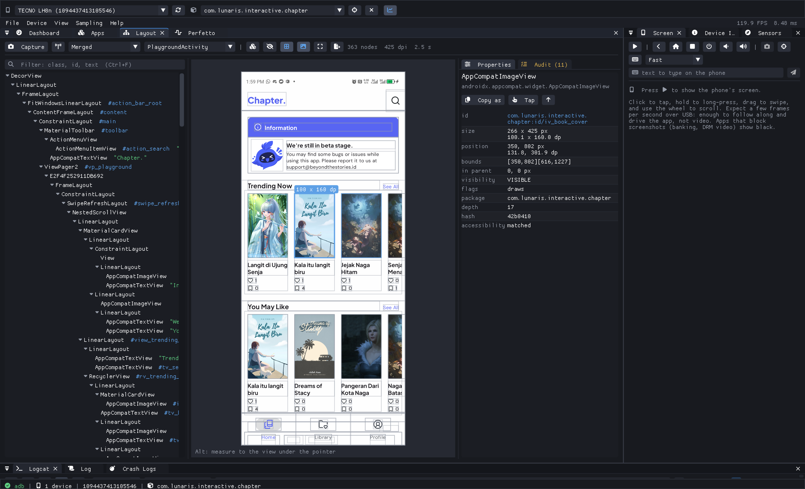

# emeron

A host-side Android inspector. It runs on your laptop and talks to the device
over adb, so nothing has to be installed in the app you are debugging.

Live device metrics, frame-time and jank analysis, a file manager, a screen
mirror with tap and type, a layout inspector, decompiled app source, logcat,
Perfetto traces, and more, in one dockable window for macOS, Linux and Windows.



## Build

Requires CMake 3.25+ and a C++20 compiler (Apple Clang 14+, GCC 11+, or MSVC
19.3x+). Dependencies are vendored in [vendor/](vendor/), so no network is
needed.

```sh
cmake -S . -B build -G Ninja -DCMAKE_BUILD_TYPE=RelWithDebInfo
cmake --build build
./build/emeron
```

Tests:

```sh
./build/tests/emeron_tests
```

Linux also needs the GLFW dependencies:

```sh
sudo apt install build-essential cmake ninja-build libgl1-mesa-dev \
    libx11-dev libxrandr-dev libxinerama-dev libxcursor-dev libxi-dev
```

## Requirements at run time

- **adb**, from the Android SDK platform-tools. emeron finds it on `PATH`,
  through `$ANDROID_HOME`, or with `--adb <path>`.
- **jadx** and a JDK 11+, only for the Code panel.
- **trace_processor_shell**, only for Perfetto queries.

## License

MIT. See [LICENSE.txt](LICENSE.txt).
